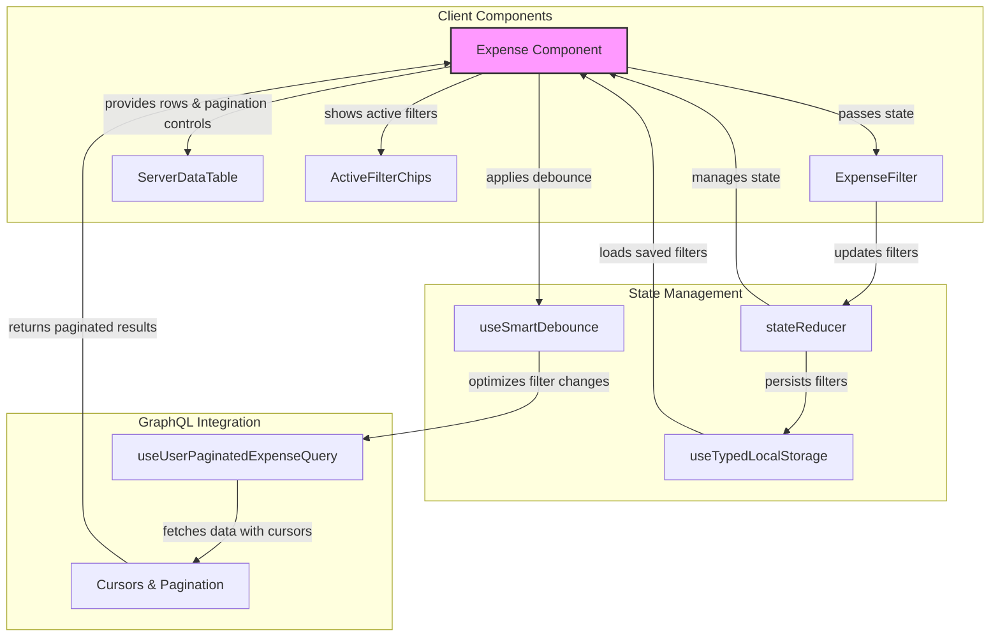

# Advanced React Data Table Documentation: Server-Side Pagination & Filtering

This comprehensive guide explains our implementation of server-side pagination and filtering in React data tables with GraphQL. The system leverages optimizations like local storage persistence, smart debouncing, and efficient state management.

## Architecture Overview



## Core Components

### 1. Main Container (Expense Component)

The Expense component serves as the controller that:

- Maintains pagination state and filter values
- Coordinates data fetching via GraphQL
- Handles user interactions (filtering, page changes, item actions)
- Orchestrates the flow between child components

### 2. Filter Component (ExpenseFilter)

This component provides the user interface for:

- Date period filtering (YYYY-MM format)
- Numeric range filtering (min/max amount)
- Status selection (multi-select dropdown)
- Responsive design (accordion on mobile, inline on desktop)

### 3. Data Table Component (ServerDataTable)

A wrapper around MUI's DataGrid that:

- Displays paginated data with proper column formatting
- Handles server-side pagination controls
- Provides toolbar with column visibility and density controls
- Integrates the filter component into its toolbar

### 4. Active Filter Display (ActiveFilterChips)

Shows active filters as chips that:

- Provide visual feedback of currently applied filters
- Allow quick removal of individual filters
- Display loading state during filter operations

## Key Optimizations

### 1. Smart Debouncing

The `useSmartDebounce` hook applies different debounce delays to different types of filters:

```javascript
// Shorter delay for dropdown selections (200ms)
const debouncedDiscreteFilters = useDebounce(discreteFilters, 200);

// Longer delay for numeric inputs (600ms)
const debouncedRangeFilters = useDebounce(rangeFilters, 600);
```

This improves user experience by:

- Applying dropdown selections almost immediately
- Delaying numeric range queries until the user stops typing

### 2. Filter Persistence with Local Storage

The system persists filter settings between sessions using local storage:

```javascript
const [savedFilters, setSavedFilters] = useTypedLocalStorage < ExpenseFilterValues > ('expenseFilters', {});
```

This allows users to maintain their filter context between page visits.

### 3. Efficient Cursor-Based Pagination

The implementation uses cursor-based pagination for GraphQL queries:

```javascript
const variables = useMemo(
  () => ({
    session_id: sessionAdmin.adminID,
    input: {
      first: paginationModel.pageSize,
      after: cursors[paginationModel.page] ?? null,
      // Filter variables...
    },
  }),
  [
    /* dependencies */
  ]
);
```

This approach:

- Prevents data skipping when items are added/removed
- Is more efficient than offset-based pagination for large datasets
- Maintains consistent page boundaries

### 4. State Management with useReducer

The component uses `useReducer` to manage complex state changes:

```javascript
const [state, dispatch] = useReducer(stateReducer, {
  ...initialState,
  filters: savedFilters,
});
```

Actions include:

- Setting pagination models
- Updating filter values
- Managing cursor state
- Tracking loading states

## Data Flow

1. **Initial Load:**

   - Load saved filters from local storage
   - Initialize pagination at page 0
   - Fetch first page of data with any saved filters

2. **Filter Changes:**

   - User updates filter values
   - Smart debounce applies appropriate delay
   - Reset to page 0 and clear cursors
   - Fetch filtered data with updated query parameters

3. **Pagination:**

   - User changes page
   - System looks up or stores cursor for that page
   - Fetch next/previous page using cursor

4. **Data Interaction:**
   - Action menu for view/edit/delete operations
   - After deletion, refetch current page
   - Responsive UI adjustments based on screen size

## Implementation Details

### Filter State Management

The `ExpenseFilterValues` interface defines the shape of our filter state:

```typescript
export interface ExpenseFilterValues {
  expense_period?: string | null;
  min_amount?: number | null;
  max_amount?: number | null;
  status?: ExpenseStatus[] | null;
}
```

These values are:

1. Applied by the user through the filter component
2. Saved to local storage for persistence
3. Debounced to prevent excessive API calls
4. Displayed as chips for user feedback
5. Sent as parameters to the GraphQL query

### GraphQL Query Variables

The system constructs GraphQL variables combining pagination and filter parameters:

```javascript
{
  session_id: sessionAdmin.adminID,
  input: {
    first: paginationModel.pageSize,
    after: cursors[paginationModel.page] ?? null,
    expense_period: debouncedFilters.expense_period ?? undefined,
    min_amount: debouncedFilters.min_amount ?? undefined,
    max_amount: debouncedFilters.max_amount ?? undefined,
    statuses: debouncedFilters.status ?? undefined,
  }
}
```

### Visual Loading States

The implementation shows loading indicators:

- During initial data fetch (full loading spinner)
- During filter operations (subtle visual cues)
- During pagination (data grid loading state)

## Best Practices and Development Guidelines

1. **Memoize Expensive Calculations:**

   ```javascript
   const rowData = useMemo(() => {
     /* data transformation */
   }, [dependencies]);
   ```

2. **Extract Reusable Logic to Custom Hooks:**

   ```javascript
   const debouncedFilters = useSmartDebounce(filters);
   ```

3. **Respect Mobile and Desktop Experiences:**

   ```javascript
   const isMobile = useMediaQuery(theme.breakpoints.down('md'));
   // Conditional rendering based on screen size
   ```

4. **Handle Error States Gracefully:**

   ```javascript
   {
     error && <ErrorAlert message={`Error loading data: ${error.message}`} />;
   }
   ```

5. **Optimize Renders with useCallback:**
   ```javascript
   const handlePaginationModelChange = useCallback(
     (newModel) => {
       /* logic */
     },
     [dependencies]
   );
   ```

## Implementing in New Pages

To implement server-side pagination and filtering in a new page:

1. Create a filter component specific to your data needs
2. Set up a state reducer similar to `stateReducer` in the Expense component
3. Utilize `useTypedLocalStorage` for filter persistence
4. Implement smart debouncing with `useSmartDebounce`
5. Configure your GraphQL query with cursor-based pagination
6. Use the `ServerDataTable` component for display

The architecture is designed to be reusable while allowing for domain-specific filters per data type.

## Performance Considerations

The implementation includes several performance optimizations:

- **Memoization:** Prevents unnecessary recalculations
- **Debouncing:** Reduces API calls during rapid user input
- **Cursor-based pagination:** More efficient than offset pagination
- **Conditional renders:** Only show what's needed based on state
- **Local storage:** Reduces need for filter reapplication

By following these patterns, you can build performant, user-friendly data tables with advanced filtering capabilities.
